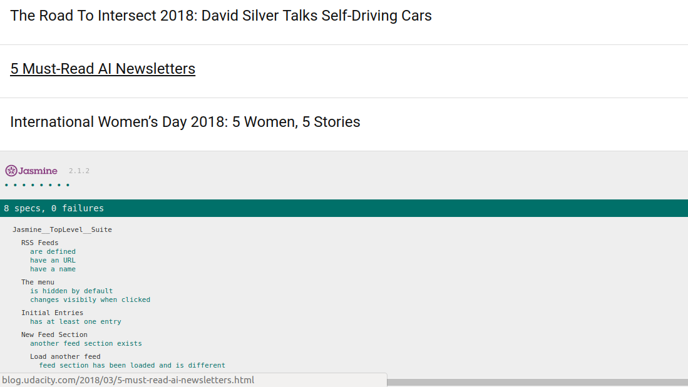

# Project Overview

This project is a test suite for an existing application. The application is a web-based application that reads RSS feeds. It is given with [Jasmine](http://jasmine.github.io/) included and a first test in the test suite as well as the structure of the tests planned to be included.

Format: 

## Tests to be done
They are devided in 4 test suites
- The RSS feed itself
 - Checking the app has some feeds do load:
    - The array containing them exists
    - Each feed in it have an URL
    - Eeach feed in it has a title
- The menu of the application
  - Check menu act as expected
    - Default state of the menu is hidden
    - First click on the menu logo makes it appear
    - Second makes it disapear
- The first feed of the menu
  - Check that this feed is loads properly and is not empty
- Being able to load another entry.
  - Check other feeds acts as expected
    - Check that we have more than one feed entry in the menu
    - Load another entry and check a different one is displayed.

## What has been done
- Document myself about JavaScript Testing
  - Udacity [course](https://www.udacity.com/course/ud549)
  - [Jasmine documentation](http://jasmine.github.io)
- Understand how the application works
  - index.html
  - Css file to get how the menu works
  - app.js to see how feeds are loaded and displayed
- Write the tests
  - Add comments to spec/feedreader.js to configure eslinter and avoid linting errors for:
    - Global variables defined in other files
    - functions defined in other files
    - Use of jQuery
  - Write tests
    - RSS Feeds
      - check the url property of each element of allFeeds is defined
      - use the length of its value to be sure it has an initial value
      - check the name property of each element of allFeeds is defined
      - use the length ot is value to be sure it has an initial value
    - Menu
      - Check the body of the html as the menu-hidden class
      - simulate a click on the menu logo and check the menu-hidden class isn't there anymore
      - simulate a second click on the menu and check the class is back
    - First feed of the menu
      - Load the contents of the feed with a callback function because of the asychonous aspect of the function of the Google API.
      - Check the length of the entry class to be sure something has been loaded and displayed.
    - Loading a different feed
      - Check we have at least one different feed to load using the length of allFeeds array
      - Load the first feed with a callback function (asynchronous) and temporarly store the .entry-link elements then load the second feed.
      - Check the first url provided by each loaded feed is different using the jQuery .attr''href') .
- Replace the http with https in the link and script tags to allow running the project on servers like github.io.

## Running the project
Clone this repository or dowload the compressed files.
Once done you should have a directory and file stucture looking like that:
- My project directory
    - css
      - icomoon.css
      - normalize.css
      - style.css
    - fonts
    - jasmine
      - lib
      - spec
        - feedreader.js
      - js
        - app.js
      - index.html

All in the fonts and lib directory is provided, no need to change. The specific files of the projects are index.html, style.css and feedreader.js  
To run the project just load index.html in your browser. And scroll down to see the result of the tests.

Or you can also just run it by clicking [here](https://alain91530.github.io/projects/feedreader/index.html)

## Author
Alain Cadenat
